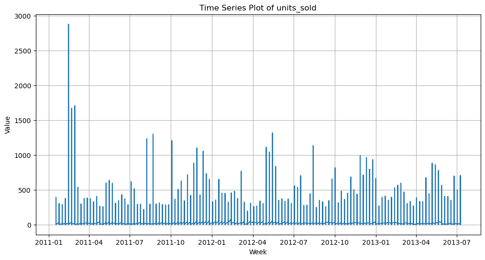

# Forcasting Model

A retail chain in India wants to use data source to build an efficient forecasting model to predict the sales SKU wise in its portfolio at its 76 different stores using historical sales data for the past 3 years on a week-on-week basis. Sales and promotional seasonality is available for each week -SKU and store wise. So we try to answer the question of wether we can accurately predict/forecast the sales values for each product for the next 12 weeks.

## Roll Numbers

- Aashish Joshua James - (SE20UARI002)
- Abhi Muvva - (SE20UARI003)
- Bada Sriya - (SE20UARI030)
- Rekhita Sree - (SE20UARI124)
- Yashwanth Reddy Chinnamallu - (SE20UARI169)
## Data Pre-processing
### Dealing with missing values
```
data = pd.read_csv('Traindata.csv')

missing_values = data.isnull().sum()
print(missing_values)
data['total_price'] = data['total_price'].ewm(alpha=0.2).mean()
```
We are replacing the missing values using **EWMA**

### Removal of Outliers
```
# Calculate the IQR for the 'units_sold' column
Q1 = data['units_sold'].quantile(0.25)
Q3 = data['units_sold'].quantile(0.75)
IQR = Q3 - Q1

# Define the lower and upper bounds for outliers
lower_bound = Q1 - 1.5 * IQR
upper_bound = Q3 + 1.5 * IQR

# Find and remove outliers
data_no_outliers = data[(data['units_sold'] >= lower_bound) & (data['units_sold'] <= upper_bound)]
```

The above code is used to remove any outliers, we are **removing values** which pass the threshold of the **25th and 75th percentile** respectively


## Data Visualization
```
data_v1 = pd.read_csv('Traindata.csv')

data_v1['week'] = pd.to_datetime(data_v1['week'], format='%d-%m-%Y')

plt.figure(figsize=(12, 6))
plt.plot(data_v1['week'], data_v1['units_sold'])
plt.title(f'Time Series Plot of units_sold')
plt.xlabel('Week')
plt.ylabel('Value')
plt.grid(True)
plt.show()
```


```
data_v2 = pd.read_csv('Traindata.csv')

data_v2['week'] = pd.to_datetime(data_v2['week'], format='%d-%m-%Y')

# Assuming 'data' is your DataFrame and 'week' is your datetime column
data_v2['week'] = pd.to_datetime(data_v2['week'])
data_v2.set_index('week', inplace=True)

# Resample the data to have a weekly frequency
data_v2 = data_v2.resample('W').sum()  # You can change 'sum' to another aggregation method if needed

# Perform seasonal decomposition
result = seasonal_decompose(data_v2['units_sold'], model='additive')

# Plot the components (trend, seasonal, and residual)
result.plot()
plt.show()
```


From the above image we can see that the data has a Decreasing Trend aswell as Seasonality so we can apply the ***Holt-Winters Exponential Smoothing***

## Data Normalization
We need to normalize the data as It helps keep all the features on a consistent scale for fair comparision. 

```
from statsmodels.tsa.holtwinters import ExponentialSmoothing

# Load your data (replace 'your_data.csv' with the actual filename)
data = pd.read_csv('normalized_data.csv')

# Group data by 'store_id' and 'week'
grouped = data.groupby(['store_id', 'week'])

# Initialize an empty DataFrame to store the predictions
predictions = pd.DataFrame(columns=['predicted_units_sold'])

# Define HWES hyperparameters (you may need to adjust these)
trend_type = 'add'  # or 'additive', depending on your data
seasonal_type = 'mul'  # or 'additive', depending on your data
seasonal_periods = 52  # assuming weekly data with yearly seasonality

# Iterate through each store and perform HWES forecasting
for (store_id, week), group in grouped:

    # Use "estimated" initialization method
    model = ExponentialSmoothing(group['units_sold'], trend=trend_type, seasonal=seasonal_type, seasonal_periods=seasonal_periods, initialization_method='estimated')
    result = model.fit()

    # Forecast the next 12 weeks
    forecast = result.forecast(steps=12)
    
    # Ensure non-negative predictions
    forecast = forecast.apply(lambda x: max(0, x))
    
    # Create a DataFrame for the predictions and append to the 'predictions' DataFrame
    pred_df = pd.DataFrame({'predicted_units_sold': forecast})
    predictions = pd.concat([predictions, pred_df])

# Save the final predictions to a CSV file
predictions.to_csv('hwes_predictions.csv', index=False)

```


As you can see we **cannot run Holt-Winter** as the data has less than two full seasonal cycles so we apply holt winters with seanality component

```
from statsmodels.tsa.holtwinters import ExponentialSmoothing

# Load your data (replace 'your_data.csv' with the actual filename)
data = pd.read_csv('normalized_data.csv')

# Group data by 'store_id' and 'week'
grouped = data.groupby(['store_id', 'week'])

# Initialize an empty DataFrame to store the predictions
predictions = pd.DataFrame(columns=['predicted_units_sold'])

# Define HWES hyperparameters (you may need to adjust these)
trend_type = 'add'  # or 'additive', depending on your data
seasonal_type = 'mul'  # or 'additive', depending on your data
seasonal_periods = 52  # assuming weekly data with yearly seasonality

# Iterate through each store and perform HWES forecasting
for (store_id, week), group in grouped:

    # Use "estimated" initialization method
    model = ExponentialSmoothing(group['units_sold'], trend=trend_type, initialization_method='estimated')
    result = model.fit()

    # Forecast the next 12 weeks
    forecast = result.forecast(steps=12)
    
    # Ensure non-negative predictions
    forecast = forecast.apply(lambda x: max(0, x))
    
    # Create a DataFrame for the predictions and append to the 'predictions' DataFrame
    pred_df = pd.DataFrame({'predicted_units_sold': forecast})
    predictions = pd.concat([predictions, pred_df])

# Save the final predictions to a CSV file
predictions.to_csv('hwes_predictions.csv', index=False)

```

The above given **Holt-Winter Holt-Winters Exponential Smoothing** is predicting negative values hence we are gonna some other forecasting techniques such as
- Linear Regression
- Random Forest
- Gradient Boost
- LSTM
- Prophet

## Linear Regression
```
import pandas as pd
from sklearn.linear_model import LinearRegression

# Load your data (replace 'your_data.csv' with the actual filename)
data = pd.read_csv('normalized_data.csv')

# Group data by 'store_id' and 'week'
grouped = data.groupby(['store_id', 'week'])

# Initialize an empty DataFrame to store the predictions
predictions = pd.DataFrame(columns=['store_id', 'week', 'predicted_units_sold'])

# Iterate through each store and perform linear regression forecasting
for (store_id, week), group in grouped:

    # Fit a linear regression model
    X = group.index.values.reshape(-1, 1)  # Assuming 'week' is your time variable
    y = group['units_sold']
    model = LinearRegression().fit(X, y)

    # Forecast the next 12 weeks
    future_weeks = [group.index[-1] + i + 1 for i in range(12)]
    forecast = model.predict(np.array(future_weeks).reshape(-1, 1))

    # Create a DataFrame for the predictions and append to the 'predictions' DataFrame
    pred_df = pd.DataFrame({'store_id': store_id, 'week': future_weeks, 'predicted_units_sold': forecast})
    predictions = pd.concat([predictions, pred_df])

# Save the final predictions to a CSV file
predictions.to_csv('linear_regression_predictions.csv', index=False)
```
In the above code we are
- Loading the Normalized data
- Grouping the data by 'store_id' and 'week' to prepare for store-specific linear regression forecasting.
- Iterating through each store's data and fitting a linear regression model to predict 'units_sold' overtime and then forecast the next 12 weeks.
- Saving the predictions in **linear_regression_predictions.csv**

## Random Forest
```
import pandas as pd
import numpy as np
from sklearn.ensemble import RandomForestRegressor

# Load your data (replace 'your_data.csv' with the actual filename)
data = pd.read_csv('normalized_data.csv')

# Group data by 'store_id' and 'week'
grouped = data.groupby(['store_id', 'week'])

# Initialize an empty DataFrame to store the predictions
predictions = pd.DataFrame(columns=['store_id', 'week', 'predicted_units_sold'])

# Iterate through each store and perform Random Forest regression forecasting
for (store_id, week), group in grouped:

    # Prepare the data for Random Forest
    X = group.index.values.reshape(-1, 1)  # Assuming 'week' is your time variable
    y = group['units_sold']

    # Create a Random Forest model
    model = RandomForestRegressor(n_estimators=100, random_state=42)  # You can adjust the hyperparameters

    # Fit the model
    model.fit(X, y)

    # Forecast the next 12 weeks
    future_weeks = [group.index[-1] + i + 1 for i in range(12)]
    forecast = model.predict(np.array(future_weeks).reshape(-1, 1))

    # Create a DataFrame for the predictions and append to the 'predictions' DataFrame
    pred_df = pd.DataFrame({'store_id': store_id, 'week': future_weeks, 'predicted_units_sold': forecast})
    predictions = pd.concat([predictions, pred_df])

# Save the final predictions to a CSV file
predictions.to_csv('random_forest_predictions.csv', index=False)
```
In the above code we are doing the samething as linear regression but slightly different:
- We iterate through each store's data and prepare the data for random forest and create a Random Forest Regression Model with specified hyperparameters.
- Then the model is trained on the data and later saved into a csv filed labelled **random_forest_predictions.csv**

## XGBoost
```
import pandas as pd
import numpy as np
import xgboost as xgb
from xgboost import XGBRegressor

# Load your data (replace 'your_data.csv' with the actual filename)
data = pd.read_csv('normalized_data.csv')

# Group data by 'store_id' and 'week'
grouped = data.groupby(['store_id', 'week'])

# Initialize an empty DataFrame to store the predictions
predictions = pd.DataFrame(columns=['store_id', 'week', 'predicted_units_sold'])

# Iterate through each store and perform Gradient Boosting (XGBoost) regression forecasting
for (store_id, week), group in grouped:

    # Prepare the data for XGBoost
    X = group.index.values.reshape(-1, 1)  # Assuming 'week' is your time variable
    y = group['units_sold']

    # Create an XGBoost model
    model = XGBRegressor(n_estimators=100, objective='reg:squarederror', random_state=42)  # You can adjust the hyperparameters

    # Fit the model
    model.fit(X, y)

    # Forecast the next 12 weeks
    future_weeks = [group.index[-1] + i + 1 for i in range(12)]
    forecast = model.predict(np.array(future_weeks).reshape(-1, 1))

    # Create a DataFrame for the predictions and append to the 'predictions' DataFrame
    pred_df = pd.DataFrame({'store_id': store_id, 'week': future_weeks, 'predicted_units_sold': forecast})
    predictions = pd.concat([predictions, pred_df])

# Save the final predictions to a CSV file
predictions.to_csv('xgboost_predictions.csv', index=False)
```
In the above code we are doing the samething as linear regression but slightly different:
- We iterate through each store's data and prepare the data for XGBoost regression and create a XGBoost Regression Model.


From the above models, we saw that XGBoost outputs are better. Both the Linear Regression and HWES are producing negative outputs, while Random Forest is producing the exact same value for All products for every week. Hence XGBoost's outputs are varying and better compared to all other models.
